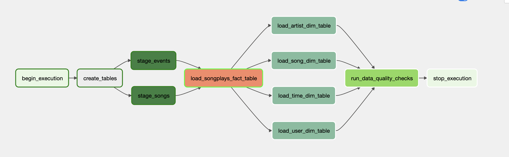

# Data pipeline using airflow

## Propose of the project

Since the sparkify a music streaming company is growing rapidly, the company wants to introduce more automation and monitoring to their data warehouse ETL pipelines.

## About datasets

The songs data & log data are in JSON format that are stored in Amazon S3

## Tech stack

- Python
- Apache Airflow
- Postgres
- AWS redshift
- Notion for project management
- Github for Version control

## Usage manual

- Create connection "aws_credentials" & "redshift" for storing aws credentials & redshift connection string, respectively.
- Create variable named s3_bucket, s3_prefix, region and json_format, which will be used in the program
- Run the airflow server using "airflow standalone command"
- Go to localhost:8080 in browser
- Run dag named sparkify_analysis to perform following task in sequence 
  - Create staging, facts and dimension tables
  - Load data from s3 to staging tables
  - Load data from staging tables to facts and dimension tables
  - Check the quality of data

## Files description

The project consists of following files:

### sparkify_dag.py

This is the major file of the project in which all of the tasks and their ordering are defined.

### create_tables.sql

This file consists of all queries required for creating staging, fact, and dimension tables.

### Operator: `staging_redshift.py`

This operator allows tasks in dag to load data from s3 to redshift staging tables

### sql_quries.py

This file consists of all sql queries that are required to load data on the facts and dimension table.

### Operator: `load_fact.py`

This operator loads data from the staging table in redshift to the fact table

### Operator: `load_dimension.py`

This operator loads data from the staging table to the dimension tables

### Operator: `data_quality.py`

This operator validates the data loaded to the facts and dimension table

## Generated DAG

- Graph view
    

- Tree view
    